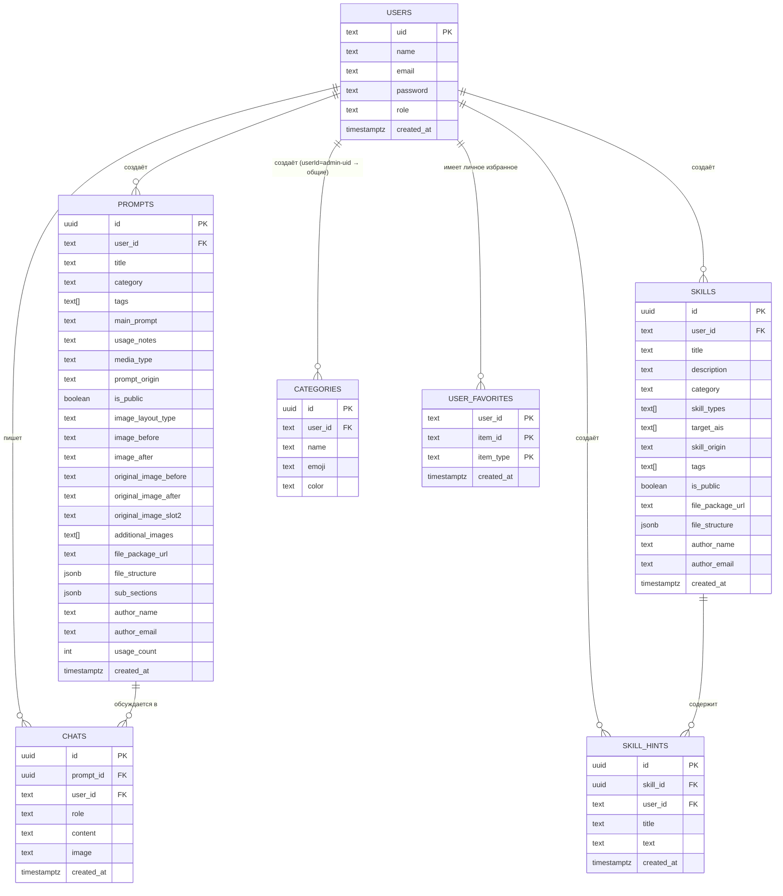

# DATABASE.md — Схема базы данных PromptVault

> Полное описание структуры базы данных Supabase PostgreSQL и Supabase Storage.
>
> **Последнее обновление**: 2026-08-10
> **Связанные файлы**: [`SCHEMA.md`](SCHEMA.md) — API-контракты, [`ARCHITECTURE.md`](ARCHITECTURE.md) — архитектура системы

---

## 📁 Текущее хранилище: Supabase PostgreSQL + Storage

Проект полностью мигрирован на **Supabase Cloud (PostgreSQL)** с хранением изображений и ZIP-пакетов в **Supabase Storage**.

| Таблица / Бакет | Назначение |
|---|---|
| `users` | Пользователи и роли (`admin`, `user`), bcrypt-хэши паролей |
| `prompts` | Промпты для нейросетей с подсекциями и макетами изображений |
| `skills` | Пакеты скиллов, субагентов и MCP с древовидной структурой файлов |
| `skill_hints` | Подсказки-промпты для быстрого применения скилла в ИИ |
| `categories` | Пользовательские и системные категории |
| `chats` | История сообщений чата с Gemini |
| `user_favorites` | Личное избранное пользователей (полиморфная связка `item_id` + `item_type`) |
| `prompt-images` (Bucket) | Хранение изображений карточек (до/после, оригиналы, слоты) |
| `prompt-files` (Bucket) | Хранение ZIP архивов пакетов скиллов |

---

## 🔗 Диаграмма связей (ER Diagram)



---

## 📐 Правила видимости данных

| Объект | Кто видит |
|--------|-----------|
| `Prompt` с `is_public: true` | Все авторизованные пользователи |
| `Prompt` с `is_public: false` | Только автор (`user_id`) + admin |
| `Skill` с `is_public: true` | Все авторизованные пользователи |
| `Skill` с `is_public: false` | Только автор + admin |
| `Category` с `user_id = admin-uid` или `null` | Все (общие категории) |
| `Category` с `user_id = uid` | Только этот пользователь |
| `ChatMessage` | Только автор (фильтр по `user_id`) |
| `SkillHint` | Все, у кого есть доступ к родительскому скиллу |
| `Favorites` | Только конкретный пользователь |
| Любая запись | Admin (`evergardenforwork@gmail.com`) видит всё |

---

## 🏷️ Значения enum-полей

### `mediaType` (Prompt)
- `photo` — Фото-промпт (по умолчанию)
- `video` — Видео-промпт (Sora, Kling, Runway, Luma)
- `text` — Текстовый промпт (ChatGPT, Claude, Gemini)
- `music` — Музыкальный промпт (Suno, Udio)

### `promptOrigin` / `skillOrigin`
- `own` — Авторский материал
- `web` — Материал, найденный в сети

### `imageLayoutType` (Prompt)
- `single` — Одиночное фото
- `slider` — Интерактивный ДО/ПОСЛЕ слайдер
- `split-vertical` — Вертикальный сплит (2 колонки)
- `split-horizontal` — Горизонтальный сплит (2 строки)
- `split-1-2` — Слева 1 большое фото, справа 2 маленьких
- `merge-2-1` — Слева 2 маленьких фото, справа 1 большое

### `skillTypes` (Skill)
- `Скилл`, `Агент`, `MCP`, `Конфиг`, `Правила`, `Шаблон`, `Хуки`, `Разное`

### `targetAis` (Skill)
- `universal`, `claude`, `gemini`, `chatgpt`, `deepseek`, `cursor`

---

## 🛠️ Полная DDL SQL-схема

```sql
-- 1. Пользователи
CREATE TABLE IF NOT EXISTS users (
    uid         TEXT PRIMARY KEY,
    name        TEXT NOT NULL,
    email       TEXT UNIQUE NOT NULL,
    password    TEXT NOT NULL,  -- bcrypt hash
    role        TEXT NOT NULL DEFAULT 'user' CHECK (role IN ('admin', 'user')),
    created_at  TIMESTAMPTZ DEFAULT NOW()
);

-- 2. Категории
CREATE TABLE IF NOT EXISTS categories (
    id         UUID PRIMARY KEY DEFAULT gen_random_uuid(),
    user_id    TEXT REFERENCES users(uid) ON DELETE SET NULL,
    name       TEXT NOT NULL,
    emoji      TEXT,
    color      TEXT,
    CONSTRAINT valid_name CHECK (length(name) > 0)
);

-- 3. Промпты
CREATE TABLE IF NOT EXISTS prompts (
    id                    UUID PRIMARY KEY DEFAULT gen_random_uuid(),
    user_id               TEXT NOT NULL REFERENCES users(uid) ON DELETE CASCADE,
    title                 TEXT NOT NULL,
    category              TEXT NOT NULL,
    tags                  TEXT[] DEFAULT '{}',
    main_prompt           TEXT NOT NULL,
    usage_notes           TEXT DEFAULT '',
    media_type            TEXT DEFAULT 'photo' CHECK (media_type IN ('photo','video','text','music')),
    prompt_origin         TEXT DEFAULT 'own' CHECK (prompt_origin IN ('own','web')),
    is_public             BOOLEAN DEFAULT FALSE,
    image_layout_type     TEXT DEFAULT 'single',
    image_before          TEXT,
    image_after           TEXT,
    original_image_before TEXT,
    original_image_after  TEXT,
    original_image_slot2  TEXT,
    additional_images     TEXT[] DEFAULT '{}',
    file_package_url      TEXT,
    file_structure        JSONB DEFAULT '[]',
    sub_sections          JSONB DEFAULT '[]',
    author_name           TEXT,
    author_email          TEXT,
    usage_count           INT DEFAULT 0,
    created_at            TIMESTAMPTZ DEFAULT NOW()
);

-- 4. Скиллы (Skills & AI Hub)
CREATE TABLE IF NOT EXISTS skills (
    id               UUID PRIMARY KEY DEFAULT gen_random_uuid(),
    user_id          TEXT NOT NULL REFERENCES users(uid) ON DELETE CASCADE,
    title            TEXT NOT NULL,
    description      TEXT DEFAULT '',
    category         TEXT DEFAULT '',
    skill_types      TEXT[] DEFAULT '{}',
    target_ais       TEXT[] DEFAULT '{}',
    skill_origin     TEXT DEFAULT 'own',
    tags             TEXT[] DEFAULT '{}',
    is_public        BOOLEAN DEFAULT FALSE,
    file_package_url TEXT,
    file_structure   JSONB DEFAULT '[]',
    author_name      TEXT,
    author_email     TEXT,
    created_at       TIMESTAMPTZ DEFAULT NOW()
);

-- 5. Подсказки к скиллам (Skill Hints)
CREATE TABLE IF NOT EXISTS skill_hints (
    id          UUID PRIMARY KEY DEFAULT gen_random_uuid(),
    skill_id    UUID NOT NULL REFERENCES skills(id) ON DELETE CASCADE,
    user_id     TEXT NOT NULL REFERENCES users(uid) ON DELETE CASCADE,
    title       TEXT NOT NULL,
    text        TEXT NOT NULL,
    created_at  TIMESTAMPTZ DEFAULT NOW()
);

-- 6. Чат-сообщения (AI Assistant)
CREATE TABLE IF NOT EXISTS chats (
    id         UUID PRIMARY KEY DEFAULT gen_random_uuid(),
    prompt_id  UUID NOT NULL REFERENCES prompts(id) ON DELETE CASCADE,
    user_id    TEXT NOT NULL REFERENCES users(uid) ON DELETE CASCADE,
    role       TEXT NOT NULL CHECK (role IN ('user', 'model')),
    content    TEXT NOT NULL,
    image      TEXT,
    created_at TIMESTAMPTZ DEFAULT NOW()
);

-- 7. Личное избранное
CREATE TABLE IF NOT EXISTS user_favorites (
    user_id    TEXT NOT NULL REFERENCES users(uid) ON DELETE CASCADE,
    item_id    TEXT NOT NULL,
    item_type  TEXT NOT NULL CHECK (item_type IN ('prompt', 'skill')),
    created_at TIMESTAMPTZ DEFAULT NOW(),
    PRIMARY KEY (user_id, item_id, item_type)
);

-- Индексы
CREATE INDEX IF NOT EXISTS idx_prompts_user_id       ON prompts(user_id);
CREATE INDEX IF NOT EXISTS idx_prompts_is_public     ON prompts(is_public);
CREATE INDEX IF NOT EXISTS idx_prompts_category      ON prompts(category);
CREATE INDEX IF NOT EXISTS idx_prompts_created_at    ON prompts(created_at DESC);
CREATE INDEX IF NOT EXISTS idx_skills_user_id        ON skills(user_id);
CREATE INDEX IF NOT EXISTS idx_skills_is_public      ON skills(is_public);
CREATE INDEX IF NOT EXISTS idx_skill_hints_skill_id  ON skill_hints(skill_id);
CREATE INDEX IF NOT EXISTS idx_user_favorites_user   ON user_favorites(user_id);
```
