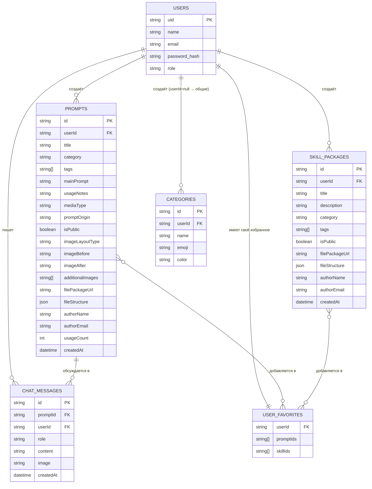

# DATABASE.md — Схема базы данных PromptVault

> Полное описание структуры данных: текущее JSON-хранилище и эквивалентная SQL-схема
> для понимания связей и подготовки к миграции на Supabase.
>
> **Обновлено**: 2026-07-27
> **Связанные файлы**: [`SCHEMA.md`](SCHEMA.md) — API-контракты, [`ARCHITECTURE.md`](ARCHITECTURE.md) — архитектура системы

---

## 📁 Текущее хранилище: JSON-файлы

Все данные живут в папке `data/` в виде плоских JSON-объектов формата `{ [id: string]: Entity }`.

| Файл | Аналог SQL-таблицы | Размер |
|------|--------------------|--------|
| `data/users.json` | `users` | ~5 записей |
| `data/prompts.json` | `prompts` + `subsections` (встроены) | ~132KB, ~130 записей |
| `data/skills.json` | `skill_packages` + `file_nodes` (встроены) | переменный |
| `data/categories.json` | `categories` | ~12 записей |
| `data/chats.json` | `chat_messages` | растёт с использованием |
| `data/favorites.json` | `user_favorites` (join table) | ~5 записей |
| `data/images/` | Supabase Storage bucket | бинарные файлы |

---

## 🗂️ Структура каждой коллекции

### `data/users.json`

Ключ — `email` пользователя.

```json
{
  "alexey.unstam@gmail.com": {
    "uid":      "admin-uid",
    "name":     "Admin",
    "email":    "alexey.unstam@gmail.com",
    "password": "$2b$10$...",    // bcrypt hash
    "role":     "admin"          // "admin" | "user"
  },
  "friend@example.com": {
    "uid":      "user_1753654987_abc123",
    "name":     "Друг",
    "email":    "friend@example.com",
    "password": "$2b$10$...",
    "role":     "user"
  }
}
```

---

### `data/prompts.json`

Ключ — уникальный ID промпта.

```json
{
  "prompt_1753654987_abc123": {
    "userId":        "admin-uid",           // → users.uid (FK)
    "title":         "Слепая разукраска",
    "category":      "Улучшение качества",  // → categories.name (мягкий FK)
    "tags":          ["аниме", "цвет"],
    "mainPrompt":    "Ты — GEM-BOT...",
    "usageNotes":    "Подсказки как использовать",
    "mediaType":     "photo",               // "photo"|"video"|"text"|"music"
    "promptOrigin":  "own",                 // "own"|"web"
    "isPublic":      true,
    "isFavorite":    false,                 // ⚠️ устарело — вычисляется из favorites.json
    "imageBefore":   "/uploads/xxx_before.jpg",
    "imageAfter":    "/uploads/xxx_after.jpg",
    "originalImageBefore": "/uploads/xxx_orig.jpg",
    "originalImageAfter":  "/uploads/xxx_orig2.jpg",
    "originalImageSlot2":  "/uploads/xxx_slot2.jpg",
    "additionalImages": ["/uploads/xxx_add_0.jpg"],
    "imageLayoutType": "split-vertical",    // см. ниже
    "subSections":   [ /* SubSection[] */ ],
    "filePackageUrl": "/uploads/pack.zip",
    "fileStructure": [ /* FileNode[] */ ],
    "authorName":    "Admin",
    "authorEmail":   "alexey.unstam@gmail.com",
    "usageCount":    7,
    "createdAt":     "2026-07-01T21:56:22.890Z"
  }
}
```

**Встроенный тип SubSection** (массив внутри промпта):

```json
{
  "title":              "Заголовок подсекции",
  "text":               "Текст промпта подсекции",
  "imageBefore":        "/uploads/...",
  "imageAfter":         "/uploads/...",
  "originalImageBefore": "/uploads/...",
  "originalImageAfter":  "/uploads/...",
  "originalImageSlot2":  "/uploads/...",
  "additionalImages":   [],
  "imageLayoutType":    "single"
}
```

---

### `data/skills.json`

```json
{
  "skill_1753654987_xyz": {
    "userId":       "admin-uid",   // → users.uid (FK)
    "title":        "React Boilerplate",
    "description":  "Стартовый шаблон...",
    "category":     "Frontend",
    "tags":         ["react", "typescript"],
    "fileStructure": [ /* FileNode[] — дерево файлов */ ],
    "filePackageUrl": "/uploads/skill_pack.zip",
    "isFavorite":   false,         // ⚠️ устарело — вычисляется из favorites.json
    "isPublic":     false,
    "authorName":   "Admin",
    "authorEmail":  "alexey.unstam@gmail.com",
    "createdAt":    "2026-07-20T12:00:00.000Z"
  }
}
```

**Встроенный тип FileNode** (рекурсивное дерево файлов):

```json
{
  "name":     "src",
  "path":     "src",
  "type":     "directory",         // "file" | "directory"
  "children": [
    {
      "name":    "App.tsx",
      "path":    "src/App.tsx",
      "type":    "file",
      "content": "import React...", // текст файла
      "size":    4096
    }
  ]
}
```

---

### `data/categories.json`

```json
{
  "cat_1753654987_aaa": {
    "name":   "Улучшение качества",
    "emoji":  "✨",
    "color":  "#38bdf8",
    "userId": "admin-uid"  // → users.uid (FK) — null/admin-uid = видна всем
  }
}
```

---

### `data/chats.json`

```json
{
  "msg_1753654987_bbb": {
    "promptId":  "prompt_1753654987_abc123",  // → prompts.id (FK)
    "userId":    "admin-uid",                 // → users.uid (FK)
    "role":      "user",                      // "user" | "model"
    "content":   "Как улучшить этот промпт?",
    "image":     "/uploads/msg_xxx_chat.jpg", // или null
    "createdAt": "2026-07-27T12:00:00.000Z"
  }
}
```

---

### `data/favorites.json`

Персональное избранное каждого пользователя. Аналог join-таблицы.

```json
{
  "admin-uid": {
    "prompts": ["prompt_abc123", "prompt_xyz456"],
    "skills":  ["skill_abc789"]
  },
  "user_1753654987_abc123": {
    "prompts": ["prompt_abc123"],
    "skills":  []
  }
}
```

> ⚠️ **Важно**: `isFavorite` в промпте/скилле — **устаревшее поле** (legacy).
> Сервер при каждом `GET /api/prompts` вычисляет актуальный `isFavorite` из `favorites.json`
> для текущего пользователя и перезаписывает значение в ответе.

---

## 🔗 Диаграмма связей (ER)



---

## 📐 Правила видимости данных

| Объект | Кто видит |
|--------|-----------|
| `Prompt` с `isPublic: true` | Все авторизованные пользователи |
| `Prompt` с `isPublic: false` | Только автор (`userId`) + admin |
| `SkillPackage` с `isPublic: true` | Все авторизованные |
| `SkillPackage` с `isPublic: false` | Только автор + admin |
| `Category` с `userId = admin-uid` или `null` | Все (общие категории) |
| `Category` с `userId = uid` | Только этот пользователь |
| `ChatMessage` | Только автор (фильтр по `userId`) |
| `Favorites` | Только конкретный пользователь |
| Всё вообще | Admin видит всё |

---

## 🏷️ Значения enum-полей

### `mediaType` (Prompt)
| Значение | Значение |
|----------|---------|
| `photo` | Фото-промпт (по умолчанию) |
| `video` | Видео-промпт (Sora, Kling, Runway) |
| `text` | Текстовый промпт (ChatGPT, Claude) |
| `music` | Музыкальный промпт (Suno, Udio) |

### `promptOrigin` (Prompt)
| Значение | Значение |
|----------|---------|
| `own` | Авторский промпт |
| `web` | Найден в интернете |

### `imageLayoutType` (Prompt и SubSection)
| Значение | Описание |
|----------|----------|
| `single` | Одно изображение |
| `slider` | Слайдер Before/After |
| `split-vertical` | Два изображения рядом вертикально |
| `split-horizontal` | Два изображения рядом горизонтально |
| `split-1-2` | Одно большое + два маленьких |
| `merge-2-1` | Два маленьких + одно большое |

### `role` (User)
| Значение | Права |
|----------|-------|
| `admin` | Всё + панель управления пользователями |
| `user` | Свои + публичные промпты/скиллы |

### `role` (ChatMessage)
| Значение | Значение |
|----------|---------|
| `user` | Сообщение пользователя |
| `model` | Ответ Gemini |

---

## 🗄️ Эквивалентная SQL-схема (для Supabase)

> Это будущая схема для миграции. Скрипт: `scripts/migrateToSupabase.ts`

```sql
-- Пользователи (управляется через Supabase Auth или кастомно)
CREATE TABLE users (
    uid         TEXT PRIMARY KEY,
    name        TEXT NOT NULL,
    email       TEXT UNIQUE NOT NULL,
    password    TEXT NOT NULL,  -- bcrypt hash
    role        TEXT NOT NULL DEFAULT 'user' CHECK (role IN ('admin', 'user')),
    created_at  TIMESTAMPTZ DEFAULT NOW()
);

-- Категории
CREATE TABLE categories (
    id         TEXT PRIMARY KEY,
    user_id    TEXT REFERENCES users(uid) ON DELETE SET NULL,
    name       TEXT NOT NULL,
    emoji      TEXT,
    color      TEXT,
    -- user_id = NULL или 'admin-uid' → общая для всех
    CONSTRAINT valid_name CHECK (length(name) > 0)
);

-- Промпты
CREATE TABLE prompts (
    id                    TEXT PRIMARY KEY,
    user_id               TEXT NOT NULL REFERENCES users(uid) ON DELETE CASCADE,
    title                 TEXT NOT NULL,
    category              TEXT NOT NULL,                -- мягкий FK → categories.name
    tags                  TEXT[] DEFAULT '{}',
    main_prompt           TEXT NOT NULL,
    usage_notes           TEXT DEFAULT '',
    media_type            TEXT DEFAULT 'photo' CHECK (media_type IN ('photo','video','text','music')),
    prompt_origin         TEXT DEFAULT 'own' CHECK (prompt_origin IN ('own','web')),
    is_public             BOOLEAN DEFAULT FALSE,
    image_layout_type     TEXT DEFAULT 'single',
    image_before          TEXT,                         -- URL /uploads/...
    image_after           TEXT,
    original_image_before TEXT,
    original_image_after  TEXT,
    original_image_slot2  TEXT,
    additional_images     TEXT[] DEFAULT '{}',
    file_package_url      TEXT,
    file_structure        JSONB DEFAULT '[]',           -- FileNode[]
    sub_sections          JSONB DEFAULT '[]',           -- SubSection[] встроен
    author_name           TEXT,
    author_email          TEXT,
    usage_count           INT DEFAULT 0,
    created_at            TIMESTAMPTZ DEFAULT NOW()
);

-- Скилл-пакеты
CREATE TABLE skill_packages (
    id               TEXT PRIMARY KEY,
    user_id          TEXT NOT NULL REFERENCES users(uid) ON DELETE CASCADE,
    title            TEXT NOT NULL,
    description      TEXT DEFAULT '',
    category         TEXT DEFAULT '',
    tags             TEXT[] DEFAULT '{}',
    is_public        BOOLEAN DEFAULT FALSE,
    file_package_url TEXT,
    file_structure   JSONB DEFAULT '[]',               -- FileNode[]
    author_name      TEXT,
    author_email     TEXT,
    created_at       TIMESTAMPTZ DEFAULT NOW()
);

-- Чат-сообщения (история AI-ассистента)
CREATE TABLE chat_messages (
    id         TEXT PRIMARY KEY,
    prompt_id  TEXT NOT NULL REFERENCES prompts(id) ON DELETE CASCADE,
    user_id    TEXT NOT NULL REFERENCES users(uid) ON DELETE CASCADE,
    role       TEXT NOT NULL CHECK (role IN ('user', 'model')),
    content    TEXT NOT NULL,
    image      TEXT,                                   -- URL или null
    created_at TIMESTAMPTZ DEFAULT NOW()
);

-- Личное избранное (join-таблица)
CREATE TABLE user_favorites (
    user_id    TEXT NOT NULL REFERENCES users(uid) ON DELETE CASCADE,
    item_id    TEXT NOT NULL,                          -- prompt.id или skill.id
    item_type  TEXT NOT NULL CHECK (item_type IN ('prompt', 'skill')),
    created_at TIMESTAMPTZ DEFAULT NOW(),
    PRIMARY KEY (user_id, item_id, item_type)
);

-- Индексы для производительности
CREATE INDEX idx_prompts_user_id    ON prompts(user_id);
CREATE INDEX idx_prompts_is_public  ON prompts(is_public);
CREATE INDEX idx_prompts_category   ON prompts(category);
CREATE INDEX idx_prompts_created_at ON prompts(created_at DESC);
CREATE INDEX idx_chat_messages_prompt_id ON chat_messages(prompt_id, user_id);
CREATE INDEX idx_user_favorites_user_id  ON user_favorites(user_id);

-- RLS (Row Level Security) — каждый видит только своё
ALTER TABLE prompts ENABLE ROW LEVEL SECURITY;
CREATE POLICY "prompts_select" ON prompts FOR SELECT
    USING (is_public = TRUE OR user_id = auth.uid());
CREATE POLICY "prompts_insert" ON prompts FOR INSERT
    WITH CHECK (user_id = auth.uid());
CREATE POLICY "prompts_update" ON prompts FOR UPDATE
    USING (user_id = auth.uid());
CREATE POLICY "prompts_delete" ON prompts FOR DELETE
    USING (user_id = auth.uid());
```

---

## 🔄 Слабые связи (Soft References)

В JSON-хранилище нет foreign key constraints. Вот где они нарушаются:

| Поле | Откуда | Куда | Что происходит при удалении |
|------|--------|------|-----------------------------|
| `prompt.category` | `prompts.json` | `categories.name` | Промпт остаётся с "осиротевшей" категорией — это нормально |
| `chat.promptId` | `chats.json` | `prompts.id` | При удалении промпта — `DELETE /api/prompts/:id` чистит чаты вручную |
| `favorites.prompts[]` | `favorites.json` | `prompts.id` | При удалении промпта favorites **не очищается** — tech debt |
| `prompt.userId` | `prompts.json` | `users.uid` | При удалении юзера — его промпты остаются (orphaned) |

> **Tech debt**: При удалении пользователя или промпта нужно каскадно чистить `favorites.json`.
> В SQL это решается `ON DELETE CASCADE`.

---

## 🧩 Пример полного промпта (реальные данные)

```json
{
  "0iR1v0jz3105J5vWZFMj": {
    "userId":        "M0aIHgLG4HRlVq7KtBYqFOvlx7l1",
    "title":         "Слепая Разукраска",
    "category":      "Разное",
    "tags":          ["раскраска", "цвет"],
    "imageBefore":   "/uploads/0iR1v0jz3105J5vWZFMj_root_imageBefore_1.jpg",
    "imageAfter":    "/uploads/0iR1v0jz3105J5vWZFMj_root_imageAfter_2.jpg",
    "subSections":   [],
    "authorName":    "Alekin",
    "authorEmail":   "evergardenforwork@gmail.com",
    "additionalImages": [],
    "isFavorite":    false,
    "createdAt":     "2026-07-01T21:56:22.890Z",
    "mainPrompt":    "Ты — GEM-BOT...",
    "usageNotes":    "Слепая расскраска арта...",
    "isPublic":      true,
    "usageCount":    7
  }
}
```
