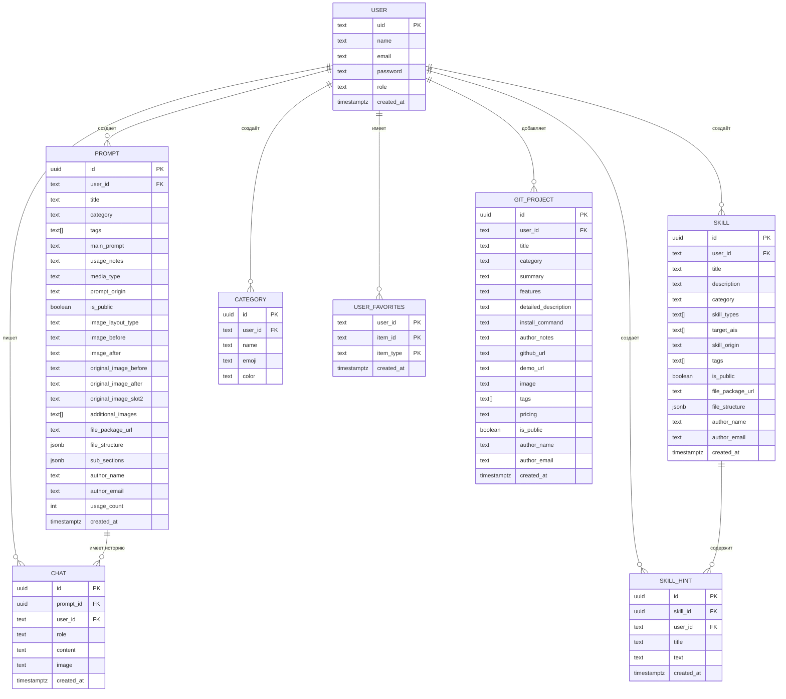

# SCHEMA.md — Database & API Schema

> Полностью соответствует реальным данным проекта. Обновлять при изменении types.ts или server.ts.
> **Последнее обновление**: 2026-08-23

## Database Tables & Relationships (ER Diagram)

## Table Schemas & Column Definitions

### `users` (Supabase Table)

| Поле | Тип | Описание |
|---|---|---|
| `uid` | TEXT (PK) | Уникальный ID (используется как Bearer-токен). Admin: `admin-uid` |
| `name` | TEXT | Отображаемое имя |
| `email` | TEXT UNIQUE | Email |
| `password` | TEXT | Хэш пароля (bcrypt `$2b$10$...`) |
| `role` | `"admin"` \| `"user"` | Роль. Admin видит всё |
| `created_at` | TIMESTAMPTZ | Дата создания |

### `prompts` (Supabase Table)

| Поле | Тип | Описание |
|---|---|---|
| `id` | UUID (PK) | Авто-генерируется Supabase |
| `user_id` | TEXT | uid автора (FK → users) |
| `title` | TEXT | Название промпта |
| `category` | TEXT | Название категории (текст, не FK) |
| `tags` | TEXT[] | Хештеги |
| `main_prompt` | TEXT | Основной текст промпта |
| `usage_notes` | TEXT? | Подсказки по шаблону |
| `media_type` | TEXT | `photo` \| `video` \| `text` \| `music` |
| `prompt_origin` | TEXT | `own` \| `web` |
| `is_public` | BOOLEAN | Видимость для других |
| `image_layout_type` | TEXT | `single` \| `slider` \| `split-vertical` \| `split-horizontal` \| `split-1-2` \| `merge-2-1` |
| `image_before` | TEXT? | URL в Supabase Storage |
| `image_after` | TEXT? | URL в Supabase Storage |
| `original_image_before` | TEXT? | URL оригинала |
| `original_image_after` | TEXT? | URL оригинала |
| `original_image_slot2` | TEXT? | URL 3-го слота |
| `additional_images` | TEXT[] | Доп. изображения |
| `file_package_url` | TEXT? | Ссылка на ZIP пакет |
| `file_structure` | JSONB | Дерево файлов FileNode[] |
| `sub_sections` | JSONB | Подсекции SubSection[] |
| `author_name` | TEXT | Имя автора |
| `author_email` | TEXT | Email автора |
| `usage_count` | INT | Счётчик использования |
| `created_at` | TIMESTAMPTZ | Дата создания |

### `skills` (Supabase Table)

| Поле | Тип | Описание |
|---|---|---|
| `id` | UUID (PK) | Авто-генерируется |
| `user_id` | TEXT | uid автора |
| `title` | TEXT | Название набора |
| `description` | TEXT | Описание |
| `category` | TEXT | Категория (текст) |
| `skill_types` | TEXT[] | Типы пакета (skill, agent, mcp, config, rules, template, hooks, other) |
| `target_ais` | TEXT[] | Поддерживаемые ИИ (universal, claude, gemini, chatgpt, deepseek, cursor, other) |
| `skill_origin` | TEXT | Источник: 'own' (Авторский) или 'web' (Из сети) |
| `tags` | TEXT[] | Хештеги |
| `is_public` | BOOLEAN | Доступен ли всем |
| `file_package_url` | TEXT? | Ссылка на ZIP |
| `file_structure` | JSONB | Дерево файлов |
| `author_name` | TEXT | Имя автора |
| `author_email` | TEXT | Email автора |
| `created_at` | TIMESTAMPTZ | Дата создания |

### `skill_hints` (Supabase Table) — НОВАЯ

| Поле | Тип | Описание |
|---|---|---|
| `id` | UUID (PK) | Авто-генерируется |
| `skill_id` | UUID (FK → skills.id ON DELETE CASCADE) | Скилл |
| `user_id` | TEXT | uid создателя |
| `title` | TEXT | Заголовок подсказки |
| `text` | TEXT | Полный текст (промпт для ИИ) |
| `created_at` | TIMESTAMPTZ | Дата создания |

> ⚠️ Таблица создаётся вручную. SQL: `scripts/create_skill_hints_table.sql`

### `categories` (Supabase Table)

| Поле | Тип | Описание |
|---|---|---|
| `id` | UUID (PK) | |
| `user_id` | TEXT | uid создателя. Admin-uid = общие для всех |
| `name` | TEXT | Название |
| `emoji` | TEXT | Эмодзи |
| `color` | TEXT | Цвет (hex) |

### `chats` (Supabase Table)

| Поле | Тип | Описание |
|---|---|---|
| `id` | UUID (PK) | |
| `prompt_id` | UUID (FK → prompts.id) | Привязан к промпту |
| `user_id` | TEXT | uid пользователя |
| `role` | `"user"` \| `"model"` | Отправитель |
| `content` | TEXT | Текст сообщения |
| `image` | TEXT? | URL изображения |
| `created_at` | TIMESTAMPTZ | |

### `user_favorites` (Supabase Table)

| Поле | Тип | Описание |
|---|---|---|
| `user_id` | TEXT (PK part) | uid пользователя |
| `item_id` | TEXT (PK part) | ID промпта или скилла |
| `item_type` | TEXT (PK part) | `prompt` \| `skill` |
| `created_at` | TIMESTAMPTZ | |

### `git_projects` (Supabase Table) — Git Hub & AI Tools

| Поле | Тип | Описание |
|---|---|---|
| `id` | UUID (PK) | Авто-генерируется |
| `user_id` | TEXT (FK → users) | uid автора |
| `title` | TEXT | Название проекта |
| `category` | TEXT | `agents` \| `tools` \| `models` \| `media` \| `scrapers` \| `other` |
| `summary` | TEXT | Краткий слоган (1-2 предложения) |
| `features` | TEXT? | Ключевые фичи через `• ` буллеты |
| `detailed_description` | TEXT? | Подробное описание архитектуры |
| `install_command` | TEXT? | Команды установки/запуска |
| `author_notes` | TEXT? | Личные заметки автора |
| `github_url` | TEXT? | Ссылка на GitHub репозиторий |
| `demo_url` | TEXT? | Ссылка на демо/сайт |
| `image` | TEXT? | base64 или URL скриншота/баннера |
| `tags` | TEXT[] | Технические теги (англ., нижний регистр) |
| `pricing` | TEXT | `free` \| `freemium` \| `paid` |
| `is_public` | BOOLEAN | Видимость для других пользователей |
| `author_name` | TEXT | Имя автора |
| `author_email` | TEXT | Email автора |
| `created_at` | TIMESTAMPTZ | Дата создания |

> ⚠️ Таблица создаётся вручную. SQL: `scripts/create_git_projects_table.sql`

## Supabase Storage Buckets (PUBLIC)

| Бакет | Описание | Лимит |
|-------|----------|-------|
| `prompt-images` | Изображения промптов | 50MB |
| `prompt-files` | ZIP-пакеты скиллов | 50MB |

## API Routes by Domain

### `/api/health`
| Метод | Путь | Auth | Описание |
|---|---|---|---|
| GET | `/api/health` | ❌ | Диагностический статус сервера и env переменных |

### `/api/auth`
| Метод | Путь | Auth | Описание |
|---|---|---|---|
| POST | `/api/auth/login` | ❌ | Логин → `{ token, user }` |

### `/api/prompts`
| Метод | Путь | Auth | Описание |
|---|---|---|---|
| GET | `/api/prompts` | ✅ | Список (фильтр по userId/isPublic, поддержка limit/offset) |
| POST | `/api/prompts` | ✅ | Создать промпт |
| PUT | `/api/prompts/:id` | ✅ | Обновить (только автор или admin) |
| DELETE | `/api/prompts/:id` | ✅ | Удалить промпт + чаты |

### `/api/skills`
| Метод | Путь | Auth | Описание |
|---|---|---|---|
| GET | `/api/skills` | ✅ | Список пакетов |
| POST | `/api/skills` | ✅ | Создать пакет |
| PUT | `/api/skills/:id` | ✅ | Обновить пакет |
| DELETE | `/api/skills/:id` | ✅ | Удалить пакет |
| GET | `/api/skills/:id/hints` | ✅ | Список подсказок скилла |
| POST | `/api/skills/:id/hints` | ✅ | Создать подсказку `{ title, text }` |
| DELETE | `/api/skills/:id/hints/:hintId` | ✅ | Удалить подсказку |

### `/api/categories`
| Метод | Путь | Auth | Описание |
|---|---|---|---|
| GET | `/api/categories` | ✅ | Категории (свои + admin-uid) |
| POST | `/api/categories` | ✅ | Создать |
| DELETE | `/api/categories/:id` | ✅ | Удалить |

### `/api/chats`
| Метод | Путь | Auth | Описание |
|---|---|---|---|
| GET | `/api/chats?promptId=xxx` | ✅ | История чата |
| POST | `/api/chats` | ✅ | Добавить сообщение |
| POST | `/api/chats/clear?promptId=xxx` | ✅ | Очистить чат |

### `/api/favorites`
| Метод | Путь | Auth | Описание |
|---|---|---|---|
| GET | `/api/favorites` | ✅ | Личное избранное |
| POST | `/api/favorites/toggle` | ✅ | `{ itemId, itemType }` toggle |

### `/api/users` (admin only)
| Метод | Путь | Auth | Описание |
|---|---|---|---|
| GET | `/api/users` | ✅ admin | Список пользователей |
| POST | `/api/users` | ✅ admin | Создать пользователя |
| DELETE | `/api/users/:uid` | ✅ admin | Удалить пользователя |
| PUT | `/api/users/:uid/password` | ✅ admin | Сменить пароль |

### `/api/export-import` (admin only)
| Метод | Путь | Auth | Описание |
|---|---|---|---|
| GET | `/api/export` | ✅ admin | Скачать ZIP-бэкап |
| POST | `/api/import` | ✅ admin | Восстановить из ZIP |

### `/api/gemini` (parse-tool активен, chat/analyze временно отключены)
| Метод | Путь | Auth | Описание |
|---|---|---|---|
| POST | `/api/gemini/chat` | ✅ | Чат с историей ⏸️ (временно не используется) |
| POST | `/api/gemini/analyze` | ✅ | Анализ изображения ⏸️ (временно не используется) |
| POST | `/api/gemini/parse-tool` | ✅ | 🪄 AI Smart Parser: URL / текст / скриншот → JSON карточки Git-проекта |

### `/api/git-projects`
| Метод | Путь | Auth | Описание |
|---|---|---|---|
| GET | `/api/git-projects` | ✅ | Список Git-проектов (все публичные + свои) |
| POST | `/api/git-projects` | ✅ | Создать проект |
| PUT | `/api/git-projects/:id` | ✅ | Обновить проект (только автор или admin) |
| DELETE | `/api/git-projects/:id` | ✅ | Удалить проект |

## camelCase ↔ snake_case Mapping

| Клиент (camelCase) | БД (snake_case) |
|---|---|
| `userId` | `user_id` |
| `mainPrompt` | `main_prompt` |
| `usageNotes` | `usage_notes` |
| `mediaType` | `media_type` |
| `promptOrigin` | `prompt_origin` |
| `isPublic` | `is_public` |
| `imageLayoutType` | `image_layout_type` |
| `imageBefore` | `image_before` |
| `imageAfter` | `image_after` |
| `originalImageBefore` | `original_image_before` |
| `originalImageAfter` | `original_image_after` |
| `originalImageSlot2` | `original_image_slot2` |
| `additionalImages` | `additional_images` |
| `filePackageUrl` | `file_package_url` |
| `fileStructure` | `file_structure` |
| `subSections` | `sub_sections` |
| `authorName` | `author_name` |
| `authorEmail` | `author_email` |
| `skillTypes` | `skill_types` |
| `targetAis` | `target_ais` |
| `usageCount` | `usage_count` |
| `createdAt` | `created_at` |
| `isFavorite` | *(вычисляется из user_favorites)* |
