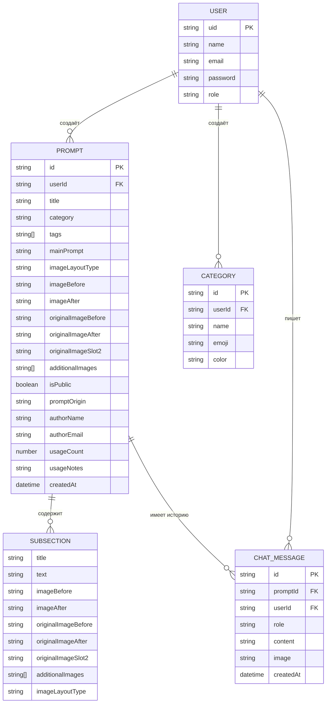

# SCHEMA.md — Database & API Schema

> Полностью соответствует реальным данным проекта. Обновляй при изменении types.ts или server.ts.

## Database Tables & Relationships (ER Diagram)



## Table Schemas & Column Definitions

### `users.json` — { [email: string]: User }

| Поле | Тип | Описание |
|---|---|---|
| `uid` | string | Уникальный ID (используется как Bearer-токен) |
| `name` | string | Отображаемое имя |
| `email` | string | Email (ключ объекта) |
| `password` | string | Хэш пароля (зашифрован с помощью bcrypt) |
| `role` | `"admin"` \| `"user"` | Роль. admin видит все промпты |

### `prompts.json` — { [id: string]: Prompt }

| Поле | Тип | Описание |
|---|---|---|
| `userId` | string | uid автора |
| `title` | string | Название промпта |
| `category` | string | ID категории |
| `tags` | string[] | Хештеги |
| `mainPrompt` | string | Основной текст промпта |
| `subSections` | SubSection[] | Подсекции с дополнительными текстами и фото |
| `imageLayoutType` | string | `single` \| `slider` \| `split-vertical` \| `split-horizontal` \| `split-1-2` \| `merge-2-1` |
| `imageBefore` | string | URL `/uploads/...` (обрезанное фото) |
| `imageAfter` | string | URL `/uploads/...` |
| `originalImageBefore` | string | URL оригинала до кроппинга |
| `originalImageAfter` | string | URL оригинала до кроппинга |
| `originalImageSlot2` | string | URL оригинала для 3-го слота |
| `additionalImages` | string[] | Доп. изображения |
| `isPublic` | boolean | Видимость для других пользователей |
| `promptOrigin` | `"own"` \| `"web"` | Происхождение промпта |
| `authorName` | string | Имя автора на момент создания |
| `authorEmail` | string | Email автора |
| `mediaType` | string | `photo` \| `video` \| `text` \| `music` \| `skill` \| `zip_package` |
| `filePackageUrl` | string? | URL скачивания оригинального ZIP-архива |
| `fileStructure` | FileNode[]? | Дерево файлов папок и файлов из ZIP (skills/prompt/SKILL.md и т.д.) |
| `usageCount` | number | Счётчик использования |
| `usageNotes` | string? | Подсказки по шаблону |
| `createdAt` | ISO string | Дата создания |

### `categories.json` — { [id: string]: Category }

| Поле | Тип | Описание |
|---|---|---|
| `userId` | string | uid создателя |
| `name` | string | Название категории |
| `emoji` | string | Эмодзи (отображается на вкладке) |
| `color` | string | Цвет (hex или tailwind) |

### `chats.json` — { [id: string]: ChatMessage }

| Поле | Тип | Описание |
|---|---|---|
| `promptId` | string | ID промпта, к которому привязан чат |
| `userId` | string | uid пользователя |
| `role` | `"user"` \| `"model"` | Отправитель |
| `content` | string | Текст сообщения |
| `image` | string? | URL изображения в сообщении |
| `createdAt` | ISO string | Дата сообщения |

## API Routes by Domain

### `/api/auth`

| Метод | Путь | Описание | Auth |
|---|---|---|---|
| POST | `/api/auth/login` | Логин: возвращает `{ token, user }` | ❌ |

### `/api/prompts`

| Метод | Путь | Описание | Auth |
|---|---|---|---|
| GET | `/api/prompts` | Список промптов (фильтр по userId/isPublic) | ✅ |
| POST | `/api/prompts` | Создать промпт | ✅ |
| PUT | `/api/prompts/:id` | Обновить промпт (только автор или admin) | ✅ |
| DELETE | `/api/prompts/:id` | Удалить промпт + чаты | ✅ |

### `/api/categories`

| Метод | Путь | Описание | Auth |
|---|---|---|---|
| GET | `/api/categories` | Категории пользователя + общие | ✅ |
| POST | `/api/categories` | Создать категорию | ✅ |
| DELETE | `/api/categories/:id` | Удалить (только владелец) | ✅ |

### `/api/chats`

| Метод | Путь | Описание | Auth |
|---|---|---|---|
| GET | `/api/chats?promptId=xxx` | История чата (изолирована по userId) | ✅ |
| POST | `/api/chats` | Добавить сообщение | ✅ |
| POST | `/api/chats/clear?promptId=xxx` | Очистить чат | ✅ |

### `/api/gemini`

| Метод | Путь | Описание | Auth |
|---|---|---|---|
| POST | `/api/gemini/chat` | Отправить сообщение в Gemini с историей | ✅ |
| POST | `/api/gemini/analyze` | Анализировать изображение через Gemini | ✅ |

### `/api/backup` (Резервное копирование)

| Метод | Путь | Описание | Auth |
|---|---|---|---|
| GET | `/api/export` | Экспорт базы данных в ZIP (только для роли admin) | ✅ |
| POST | `/api/import` | Импорт ZIP-архива в формате base64 (только для роли admin) | ✅ |

### `/uploads`

| Метод | Путь | Описание | Auth |
|---|---|---|---|
| GET | `/uploads/:filename` | Получить изображение из `data/images/` | ❌ |

## Request & Response Examples

```json
// POST /api/auth/login
// Request
{ "email": "user@example.com", "password": "secret" }
// Response
{
  "token": "admin-uid",
  "user": { "uid": "admin-uid", "displayName": "Admin", "email": "...", "role": "admin" }
}

// POST /api/prompts
// Request (упрощённо, base64 изображения передаются в imageBefore и т.д.)
{
  "title": "Портрет в стиле аниме",
  "category": "cat_xxx",
  "tags": ["аниме", "портрет"],
  "mainPrompt": "Anime style portrait...",
  "imageLayoutType": "slider",
  "imageBefore": "data:image/jpeg;base64,...",
  "isPublic": false,
  "promptOrigin": "own",
  "subSections": [],
  "additionalImages": []
}
// Response
{ "id": "prompt_1234567890_abc", "title": "...", "imageBefore": "/uploads/prompt_xxx_before.jpg", ... }
```
